<div align="center">


# Sistema Escolar — Proyecto de Login

**Actividad 5 · Programación Web**

Instituto Tecnológico de Oaxaca (TecNM) · Ingeniería en Sistemas Computacionales · Grupo 7SD


Docente: Ing. Adelina Martínez Nieto

| Integrante | Parte del proyecto |
|---|---|
| Jhonatan Poblete *pendiente | `login.html`, `css/login.css`, `js/login.js`, `js/utileria.js`, `img/`, README |
| Sixto Morales Angel | `index.html`, `css/index.css`, `js/index.js`, iconos de `img/`, README |

🔗 **Sitio en vivo (GitHub Pages):** LINK_PAGES

</div>

---

## 📋 Descripción breve  

Plataforma web ligera e interactiva diseñada para la administración escolar, el registro de usuarios y la gestión de alumnos. El sistema incluye un módulo de inicio de sesión con animación de deslizamiento (*sliding panel*), validación de contraseñas complejas en tiempo real, cálculo automatizado de edades y días faltantes para el cumpleaños de los alumnos, y un panel de control con navegación dinámica sin recarga de página.
Login funcional hecho con **HTML, CSS y JavaScript** que simula el acceso a un sistema escolar. El proyecto tiene **dos pantallas conectadas**:

- **`login.html`**: pantalla de acceso con formulario de correo y contraseña validados. Tiene un panel deslizable para *Iniciar sesión* y *Crear cuenta*. Al pasar la validación (simulada con JS, sin backend) redirige a `index.html`.
- **`index.html`**: pantalla del sistema ya "dentro". Incluye sidebar con botón hamburguesa, navbar con el nombre del usuario y su menú para salir, captura de usuarios, registro de alumnos con número de control y un modal que indica si el alumno es mayor de edad.

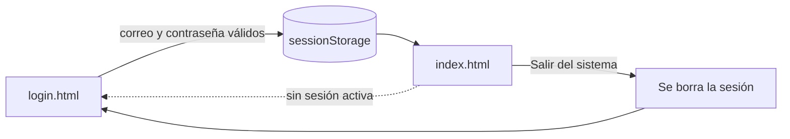

---

## 📁 Estructura del proyecto

```text
Actividad_5/
├── README.md
├── login.html          ← pantalla de acceso
├── index.html          ← pantalla del sistema
├── css/
│   ├── login.css       ← estilos del login (panel deslizable)
│   └── index.css       ← estilos del sistema (sidebar, navbar, tarjetas, modal)
├── js/
│   ├── utileria.js     ← librería de validaciones (creada en actividades anteriores)
│   ├── login.js        ← lógica del login y registro
│   └── index.js        ← lógica del sistema
└── img/
    ├── logo.svg        ← logo del sistema
    ├── menu.svg, inicio.svg, usuarios.svg, alumnos.svg, captura.svg,
    │   salir.svg, chevron.svg, ojo.svg, borrar.svg, pastel.svg   ← iconos
    └── capturas/       ← capturas de pantalla usadas en este README
```

---

## 🛠️ Explicación y documentación

### 1. Framework CSS usado: Bootstrap 5.3.3

Usamos **Bootstrap 5.3.3** (sin mezclarlo con Tailwind ni con frameworks de JS como React o Vue). Se carga desde el CDN de jsDelivr en las dos pantallas:

```html
<link href="https://cdn.jsdelivr.net/npm/bootstrap@5.3.3/dist/css/bootstrap.min.css" rel="stylesheet">
<!-- Solo en index.html, para el dropdown, el collapse del submenú, el modal y el toast -->
<script src="https://cdn.jsdelivr.net/npm/bootstrap@5.3.3/dist/js/bootstrap.bundle.min.js"></script>
<!-- Solo en index.html, para confirmaciones con SweetAlert -->
<script src="https://cdn.jsdelivr.net/npm/sweetalert2@11.14.5/dist/sweetalert2.all.min.js"></script>
```

Componentes de Bootstrap que se usaron:

| Componente | Dónde se usa |
|---|---|
| `form-control`, `is-invalid`, `invalid-feedback` | Mensajes de error en todos los formularios |
| `collapse` | Submenús desplegables **Usuarios → Captura** y **Alumnos → Registro** del sidebar |
| `dropdown` | Menú del nombre de usuario en el navbar (opción **Salir del sistema**) |
| `modal` | Modal de edad del alumno |
| `toast` | Aviso de "Usuario guardado correctamente" |
| `row`, `col-lg-*`, `card`, `table` | Acomodo de las vistas y tablas |

Los estilos propios están en `css/login.css` y `css/index.css`. Los colores del sistema vienen del logo (verde azulado `#173f4d`) y del login (coral `#ff4b2b`), para que las dos pantallas se vean como un mismo sistema.

---

### 2. Cómo fluye el login hacia el sistema

1. El usuario se registra en **Crear cuenta** o entra en **Iniciar sesión**.
2. `login.js` valida el correo con `validarCorreo()` y la contraseña con `validarPassword()` de `utileria.js`.
3. Los usuarios registrados se guardan en `localStorage` con la clave `usuarios_registrados`. Así siguen existiendo aunque se cierre el navegador.
4. Si los datos son correctos, se guarda la **sesión** en `sessionStorage` y se redirige a `index.html`:

```javascript
// js/login.js
function iniciarSesion(nombre, correo) {
    sessionStorage.setItem("usuarioNombre", nombre);
    sessionStorage.setItem("usuarioCorreo", correo);
    window.location.href = "index.html";
}
```

5. **Protección de `index.html`:** antes de dibujar la página, un script en el `<head>` revisa si hay sesión. Si no hay, regresa al login. Por eso no se puede entrar al sistema escribiendo la URL directamente.

```html
<!-- index.html -->
<script>
  if (!sessionStorage.getItem("usuarioCorreo")) {
    window.location.replace("login.html");
  }
</script>
```

6. **Salir del sistema:** se borra la sesión y se regresa al login. Se usa `location.replace` para que el botón "atrás" del navegador no vuelva a abrir el sistema.

```javascript
// js/index.js
function cerrarSesion() {
    sessionStorage.removeItem("usuarioNombre");
    sessionStorage.removeItem("usuarioCorreo");
    window.location.replace("login.html");
}
```

---

### 3. Cómo se pasa el nombre de usuario del login al navbar

El nombre viaja de una pantalla a otra mediante **`sessionStorage`**, que se conserva mientras la pestaña esté abierta.

**Paso 1 – `login.js` decide qué nombre mostrar.** Si el usuario fue capturado en *Usuarios → Captura*, se usa su nombre de usuario. Si se registró desde el login (donde solo se pide correo), se usa el correo. En ambos casos se respeta exactamente lo que escribió, con sus mayúsculas, minúsculas y números.

```javascript
// js/login.js — al iniciar sesión
let nombreParaNavbar = usuarioEncontrado.nombre || correo;
iniciarSesion(nombreParaNavbar, correo);
```

**Paso 2 – `index.js` lee la sesión y la coloca en el navbar**, en el menú desplegable, en el saludo de Inicio y en el avatar con las iniciales:

```javascript
// js/index.js
const sesionCorreo = sessionStorage.getItem("usuarioCorreo");
const sesionNombre = sessionStorage.getItem("usuarioNombre") || sesionCorreo;

function mostrarUsuarioEnNavbar() {
    document.getElementById("nombreUsuario").textContent = sesionNombre;
    document.getElementById("avatarUsuario").textContent = obtenerIniciales(sesionNombre);
    document.getElementById("menuNombre").textContent = sesionNombre;
    document.getElementById("menuCorreo").textContent = sesionCorreo;
    document.getElementById("saludoNombre").textContent = sesionNombre;
}
```

**Paso 3 – El HTML del navbar** tiene el botón con el nombre y el dropdown de Bootstrap con la opción para salir:

```html
<!-- index.html -->
<div class="dropdown ms-auto">
  <button class="btn-usuario dropdown-toggle" type="button" id="btnUsuario"
          data-bs-toggle="dropdown" aria-expanded="false">
    <span class="avatar" id="avatarUsuario">?</span>
    <span class="nombre-usuario" id="nombreUsuario">Usuario</span>
  </button>
  <ul class="dropdown-menu dropdown-menu-end shadow-sm">
    <li class="px-3 py-2">
      <div class="fw-semibold" id="menuNombre">Usuario</div>
      <div class="small text-body-secondary" id="menuCorreo">correo@ejemplo.com</div>
    </li>
    <li><hr class="dropdown-divider"></li>
    <li>
      <button class="dropdown-item text-danger btn-salir" type="button">Salir del sistema</button>
    </li>
  </ul>
</div>
```

> Se usa `textContent` (y no `innerHTML`) para escribir los datos del usuario. Así, si alguien escribe código HTML en un campo, se muestra como texto y no se ejecuta.

---

### 4. Métodos principales

#### `js/utileria.js` (funciones que se integraron)

| Función | Qué hace | Dónde se usa |
|---|---|---|
| `validarCorreo(correo)` | Revisa el formato `usuario@dominio.ext` | Login, registro y captura de usuarios |
| `validarPassword(password)` | Mínimo 8 caracteres, con mayúscula, minúscula, número y símbolo | Login, registro y captura de usuarios |
| `validarLongitud(numero, max)` | Revisa que sean solo dígitos y no pasen del máximo | Número de control (6 dígitos) |
| `soloLetras(texto)` | Solo letras, incluidos acentos, ñ y ü | Nombre y apellidos del alumno |
| `calcularEdad(fecha)` | Edad en años cumplidos (`-1` si la fecha es inválida o futura) | Modal de edad y tabla de alumnos |
| `esMayorDeEdad(fecha)` | `true` si tiene 18 años o más | Modal de edad |
| `diasParaCumple(fecha)` | Días que faltan para el próximo cumpleaños | Modal de edad |
| `capitalizarNombre(texto)` | Formato de nombre propio (`juan pérez` → `Juan Pérez`) | Nombre del alumno |

#### `js/login.js`

| Función | Qué hace |
|---|---|
| `validarCampoCorreo(input)` / `validarCampoPassword(input)` | Validan el campo y muestran el mensaje de error de Bootstrap |
| `guardarUsuario(correo, password)` | Agrega el usuario a `localStorage` |
| `buscarUsuario(correo)` | Busca un usuario sin distinguir mayúsculas |
| `iniciarSesion(nombre, correo)` | Guarda la sesión en `sessionStorage` y redirige a `index.html` |

#### `js/index.js`

| Función | Qué hace |
|---|---|
| `mostrarUsuarioEnNavbar()` | Coloca el nombre y el correo de la sesión en el navbar |
| `cerrarSesion()` | Borra la sesión y regresa a `login.html` |
| `alternarSidebar()` | Abre o cierra el sidebar con el botón hamburguesa |
| `mostrarVista(nombre)` | Muestra *Inicio*, *Usuarios → Captura* o *Alumnos → Registro* sin recargar la página |
| `validarCampoNombreUsuario()`, `validarCampoCorreoUsuario()`, `validarCampoPasswordUsuario()` | Validaciones del formulario de captura de usuarios |
| `actualizarRequisitos()` | Marca en verde cada requisito de la contraseña mientras se escribe |
| `pintarUsuarios()` / `pintarAlumnos()` | Dibujan las tablas de usuarios y alumnos registrados |
| `validarCampoControl()` | Valida que el número de control tenga exactamente 6 dígitos y no esté repetido |
| `validarCampoFecha()` | Valida la fecha de nacimiento |
| `mostrarModalEdad(alumno)` | Llena y abre el modal de edad |
| `confirmarEliminación(titulo, texto, alConfirmar)` | Pide confirmación con SweetAlert2 para eliminar un usuario o alumno |

---

## 🏗️ Proceso de creación paso a paso

### Paso 1 — Login con panel deslizable (`login.html`, `login.css`, `login.js`)

1. **Estructura:** dos formularios dentro de un mismo contenedor (*Crear cuenta* e *Iniciar sesión*) y un panel de color encima (`overlay-container`) con los botones para cambiar entre ellos.
2. **Animación:** en `login.css` los formularios usan `position: absolute` y `transform: translateX()`. Al agregar la clase `right-panel-active` al contenedor, el panel se desliza al otro lado.

```javascript
// js/login.js
signUpButton.addEventListener("click", function () {
    container.classList.add("right-panel-active");
});
signInButton.addEventListener("click", function () {
    container.classList.remove("right-panel-active");
});
```

3. **Validación:** al enviar el formulario se valida con `utileria.js`. Si algo falla, se marca el campo con `is-invalid` de Bootstrap y se escribe el mensaje:

```javascript
// js/login.js
function validarCampoPassword(input) {
    if (input.value === "") {
        mostrarError(input, "Escribe tu contraseña.");
        return false;
    }
    if (!validarPassword(input.value)) {
        mostrarError(input, "Mínimo 8 caracteres, con mayúscula, minúscula, número y símbolo.");
        return false;
    }
    return true;
}
```

4. **Registro e inicio de sesión:** se busca el correo en `localStorage`. Si existe y la contraseña coincide, se llama a `iniciarSesion()`, que redirige a `index.html`.

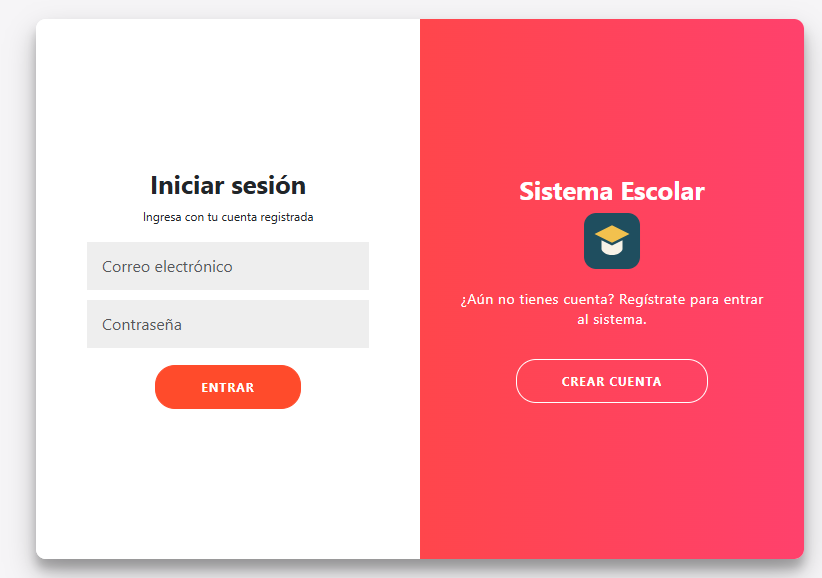

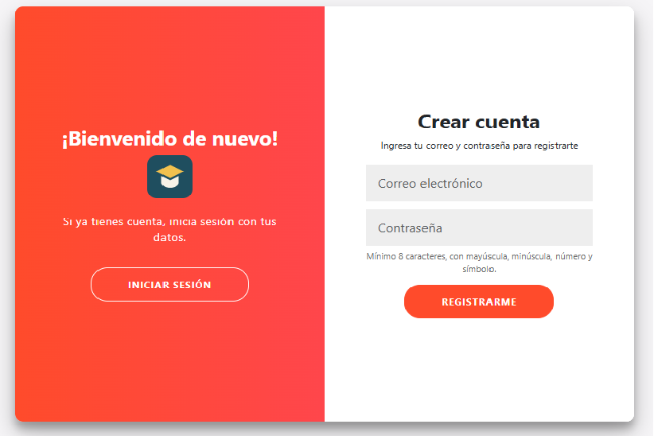


---

### Paso 2 — Sidebar con botón hamburguesa y submenú (`index.html`, `index.css`, `index.js`)

1. **Estructura:** el sidebar es un `<aside>` fijo a la izquierda. La opción **Usuarios** es un botón que abre o cierra su submenú **Captura** con el componente `collapse` de Bootstrap:

```html
<!-- index.html -->
<button class="sidebar-enlace sidebar-grupo" type="button"
        data-bs-toggle="collapse" data-bs-target="#submenuUsuarios"
        aria-expanded="true" aria-controls="submenuUsuarios">
  
  Usuarios
  
</button>
<ul class="collapse show list-unstyled submenu" id="submenuUsuarios">
  <li>
    <a href="#captura" class="sidebar-enlace" data-vista="captura">
      
      Captura
    </a>
  </li>
</ul>
```

2. **Botón hamburguesa:** en computadora el sidebar está abierto y la hamburguesa lo oculta. En celular está oculto y la hamburguesa lo muestra encima del contenido, con un fondo oscuro que también lo cierra al tocarlo.

```javascript
// js/index.js
function alternarSidebar() {
    if (esEscritorio()) {
        document.body.classList.toggle("sidebar-cerrado");
    } else {
        document.body.classList.toggle("sidebar-abierto");
    }
    actualizarAriaHamburguesa();
}
btnHamburguesa.addEventListener("click", alternarSidebar);
```

```css
/* css/index.css */
@media (min-width: 992px) {
  body.sidebar-cerrado .sidebar { transform: translateX(-100%); }
  body.sidebar-cerrado .principal { margin-left: 0; }
}
@media (max-width: 991.98px) {
  .sidebar { transform: translateX(-100%); }
  body.sidebar-abierto .sidebar { transform: translateX(0); }
}
```

3. **Cambio de vistas:** cada opción del menú tiene un atributo `data-vista`. `mostrarVista()` muestra la sección correspondiente, oculta las demás y marca la opción activa. La vista también se guarda en la URL (`#captura`), así que al recargar se queda en la misma sección.

```javascript
// js/index.js
function mostrarVista(nombre) {
    let vista = document.getElementById("vista-" + nombre);
    vistas.forEach(function (v) { v.hidden = (v !== vista); });
    tituloVista.textContent = vista.dataset.titulo;
    // ...marca como activa la opción del sidebar
}
```

4. **Iconos:** son archivos SVG de la carpeta `img/` cargados con ``. El color se ajusta con `filter` en CSS: blanco en el sidebar y rojo en *Salir* y *Eliminar*.

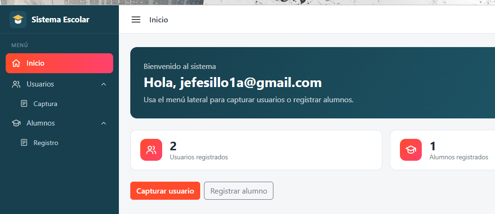

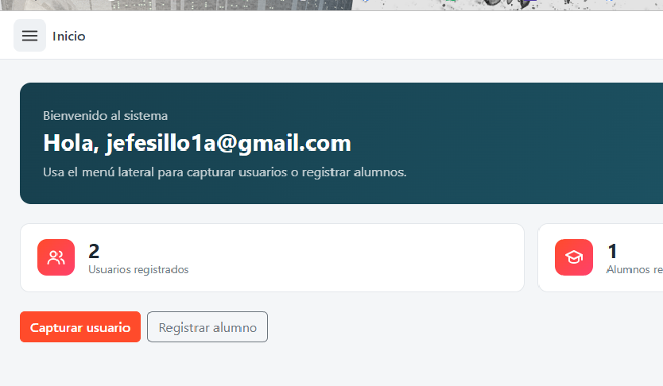

---

### Paso 3 — Usuarios → Captura

Formulario con **nombre de usuario, correo electrónico y contraseña**, validado con `validarCorreo` y `validarPassword`. Los usuarios capturados se guardan en la misma lista que usa el login, así que **después pueden iniciar sesión** con esos datos.

```javascript
// js/index.js
function validarCampoCorreoUsuario() {
    let correo = usuCorreo.value.trim();
    if (correo === "") {
        mostrarError(usuCorreo, "Escribe el correo electrónico.");
        return false;
    }
    if (!validarCorreo(correo)) {
        mostrarError(usuCorreo, "Correo no válido. Ejemplo: nombre@correo.com");
        return false;
    }
    let existe = leerLista(LLAVE_USUARIOS).some(u => u.correo === correo.toLowerCase());
    if (existe) {
        mostrarError(usuCorreo, "Este correo ya está registrado.");
        return false;
    }
    marcarValido(usuCorreo);
    return true;
}
```

Al guardar, el nombre y el correo se almacenan **tal cual se escribieron**. Además se guarda una copia del correo en minúsculas que solo sirve para buscarlo al iniciar sesión:

```javascript
// js/index.js
let correoEscrito = usuCorreo.value.trim();
usuarios.push({
    nombre: usuNombre.value.trim(),
    correo: correoEscrito.toLowerCase(),
    correoOriginal: correoEscrito,
    password: usuPassword.value
});
guardarLista(LLAVE_USUARIOS, usuarios);
```

Mientras se escribe la contraseña, cada requisito se pinta de verde cuando se cumple (`actualizarRequisitos()`).

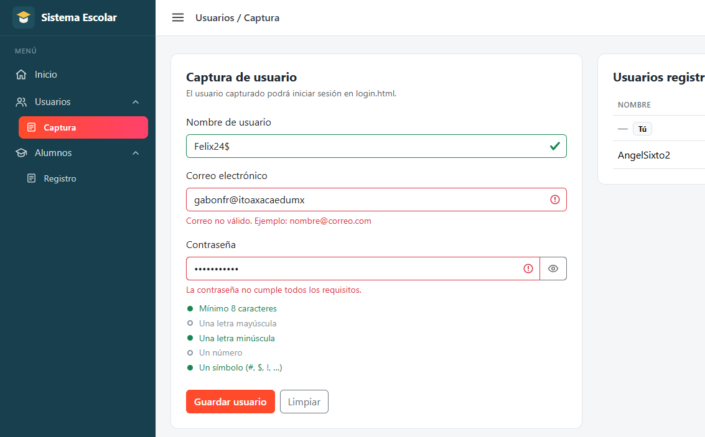

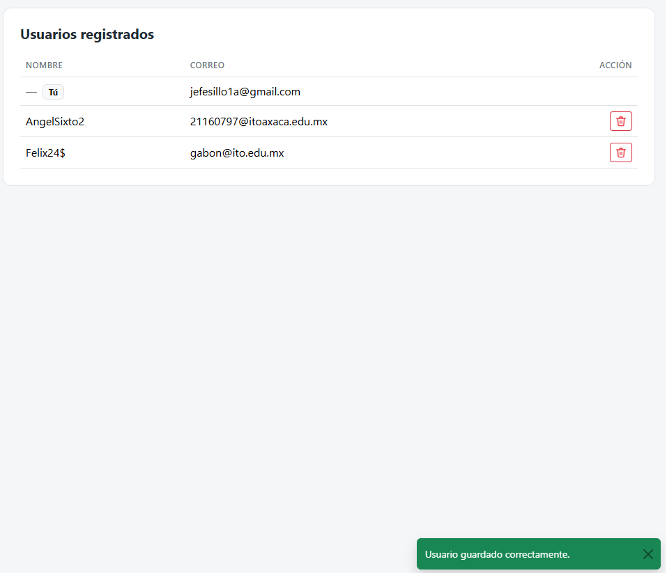

---

### Paso 4 — Navbar con el usuario y opción de salir

1. El navbar es una barra fija arriba del contenido. A la izquierda tiene el botón hamburguesa y el título de la sección; a la derecha, el avatar con iniciales y el nombre del usuario.
2. Al cargar `index.html` se ejecuta `mostrarUsuarioEnNavbar()` (ver la [sección 3](#3-cómo-se-pasa-el-nombre-de-usuario-del-login-al-navbar)).
3. Al dar clic en el nombre se abre el `dropdown` de Bootstrap con el nombre, el correo y **Salir del sistema**, que llama a `cerrarSesion()`.

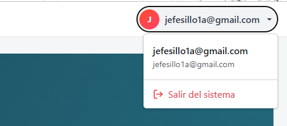

---

### Paso 5 — Formulario de alumnos con número de control

1. El campo de número de control solo acepta números: al escribir se eliminan las letras y se cortan los dígitos extra. Abajo aparece un contador `0/6`.

```javascript
// js/index.js
aluControl.addEventListener("input", function () {
    aluControl.value = aluControl.value.replace(/\D/g, "").slice(0, DIGITOS_CONTROL);
    contadorControl.textContent = aluControl.value.length;
});
```

2. Al guardar, se valida con `validarLongitud` que tenga **exactamente 6 dígitos** y que no esté repetido:

```javascript
// js/index.js
function validarCampoControl() {
    let control = aluControl.value.trim();
    if (control === "") {
        mostrarError(aluControl, "Escribe el número de control.");
        return false;
    }
    if (!validarLongitud(control, DIGITOS_CONTROL) || control.length !== DIGITOS_CONTROL) {
        mostrarError(aluControl, "El número de control debe tener exactamente 6 dígitos.");
        return false;
    }
    let repetido = leerLista(LLAVE_ALUMNOS).some(a => a.control === control);
    if (repetido) {
        mostrarError(aluControl, "Ya existe un alumno con ese número de control.");
        return false;
    }
    marcarValido(aluControl);
    return true;
}
```

3. El nombre y los apellidos se validan con `soloLetras`. La fecha de nacimiento no puede ser futura: el calendario tiene `max` con la fecha de hoy y además se revisa con `calcularEdad`.

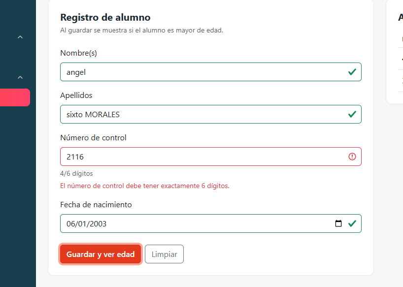

---

### Paso 6 — Modal de edad

Al guardar un alumno válido se abre un **modal de Bootstrap** que muestra su edad, si es **mayor o menor de edad** y cuántos días faltan para su cumpleaños:

```javascript
// js/index.js
function mostrarModalEdad(alumno) {
    let edad = calcularEdad(alumno.fecha);
    let mayor = esMayorDeEdad(alumno.fecha);
    let dias = diasParaCumple(alumno.fecha);

    document.getElementById("modalEdadNumero").textContent = edad;
    let estado = document.getElementById("modalEdadEstado");
    estado.textContent = mayor ? "Es mayor de edad" : "Es menor de edad";
    estado.className = "badge rounded-pill fs-6 px-3 py-2 " + (mayor ? "text-bg-success" : "text-bg-warning");

    document.getElementById("modalEdadCumple").textContent = dias === 0
        ? "¡Hoy es su cumpleaños!"
        : "Faltan " + dias + (dias === 1 ? " día" : " días") + " para su cumpleaños.";

    modalEdad.show();   // const modalEdad = new bootstrap.Modal(document.getElementById("modalEdad"));
}
```

El alumno se agrega a la tabla de **Alumnos registrados**. El botón del pastel 🎂 vuelve a abrir su modal.

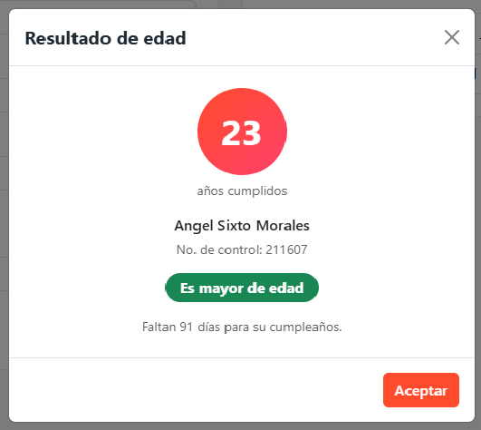

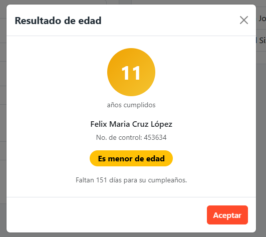

---

## 📸 Capturas del flujo completo funcionando

**Login → Index → Salir**, en GitHub Pages:

| # | Paso | Captura |
|---|---|---|
| 1 | Se abre `login.html` y se inicia sesión |  |
| 2 | Se entra a `index.html` y el navbar muestra al usuario |  |
| 3 | Se captura un usuario en **Usuarios → Captura** |  |
| 4 | Se registra un alumno y aparece el modal de edad |  |
| 5 | Se abre el menú del usuario y se elige **Salir del sistema** |  |
| 6 | Se regresa a `login.html` con la sesión cerrada | 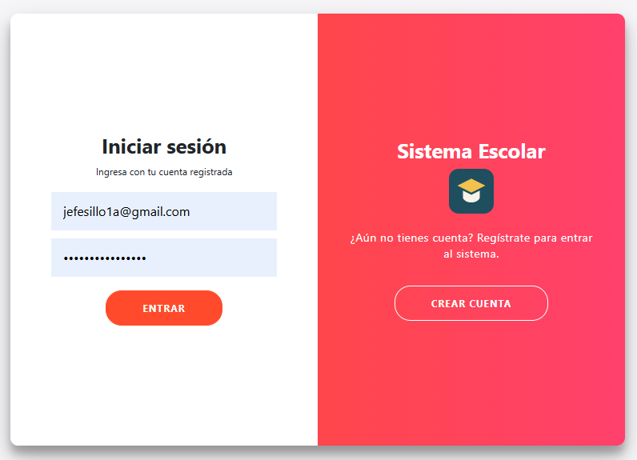 |

---

## 💻 Cómo ejecutarlo

**En línea:** abre https://jpelon-jpg.github.io/Actividad_5/login.html

**En tu computadora:**

1. Clona o descarga el repositorio:
   ```bash
   git clone https://github.com/jpelon-jpg/Actividad_5.git
   ```
2. Abre `login.html` en el navegador. Se necesita internet porque Bootstrap se carga desde el CDN.
3. En **Crear cuenta** registra un correo y una contraseña segura (ejemplo: `Segura#2026`).
4. Explora el sistema desde el sidebar y sal con el menú del nombre de usuario.

> Los usuarios y alumnos se guardan en el `localStorage` del navegador, así que solo existen en el navegador donde se registraron.